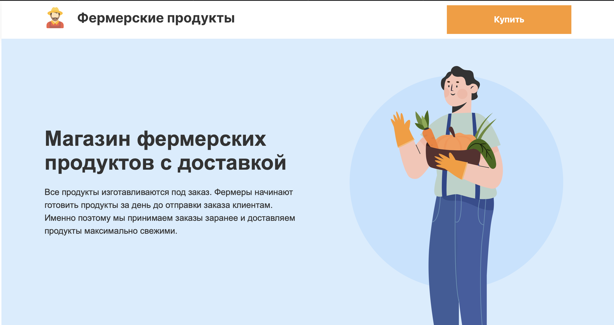

# Личный проект «Кэт-энерджи»

Учебный проект Cat-Energy выполнен в рамках курса Фронтенд разработчик от [htmlacademy](https://htmlacademy.ru)


# Результат работы

### Результат доступен по ссылке [https://farm-products-seven.vercel.app/](https://farm-products-seven.vercel.app/)

##### Вид главной страницы при загрузке



## В рамках проекта усвоены такие практические навыки как:

- ### Вёрстка React компонентов

##### Пример компонента

```jsx
export default function Info() {
  return (
    <StyledSection>
      <TextBlock>
        <StyledTitle size={TitleSize.BIG}>
          Магазин фермерских продуктов с доставкой
        </StyledTitle>
        <StyledText size={TextSize.BIG}>
          Все продукты изготавливаются под заказ. Фермеры начинают готовить
          продукты за день до отправки заказа клиентам. Именно поэтому мы
          принимаем заказы заранее и доставляем продукты максимально свежими.
        </StyledText>
      </TextBlock>
      <BackgroundElement />
    </StyledSection>
  );
}
```

- ### Стилизация компонентов с помощью styled-components

##### Пример стилизованного компонента
```jsx
export const StyledSection = styled(Section)`
  height: 600px;
  background-color: ${(props) => props.theme.backgroundColorBlue};
  display: flex;
  justify-content: flex-start;
  align-items: center;
`;
```

- ### Реализация интерактивности

##### Пример интерактивности

```jsx
const [state, setState] = useState(1300);
const [checked, setChecked] = useState(props.isChecked);
const [isCheckedIndex, setIsChekedIndex] = useState(0);

<CheckboxInput
  type="checkbox"
  name="product"
  id={`product-${props.id + 1}`}
  checked={checked}
  onChange={() => {
    setChecked(!checked);
    if (!checked) {
      setState(state + props.price);
      setIsChekedIndex(props.id);
      swiperRef.slideTo(isCheckedIndex, 0);
      setGoods([...goods, props.name]);
    } else {
        setState(state - props.price);
        setGoods(goods.filter((elem) => elem != props.name));
    }
  }}
  value={props.price}
/>
```

- ### Реализация Роутинга

##### Пример Роутинга

```jsx
<Routes>
  <Route path="/" element={<HomePage />} />
  <Route path="/order" element={<OrderPage />} />
</Routes>
```

- ### Работа с API Swiper.js

##### Пример Swiper компонента


```jsx
<StyledSwiper
  onSwiper={setSwiperRef}
  modules={[Scrollbar, Pagination, Mousewheel, FreeMode]}
  slidesPerView="auto"
  spaceBetween={12}
  direction="vertical"
  scrollbar={{
    draggable: true,
  }}
  mousewheel={{
    sensetivity: 5,
  }}
  freeMode
>
  {props.map((item) => (
    <StyledSwiperSlide>
      <Card props={item} key={props.id} />
    </StyledSwiperSlide>
  ))}
</StyledSwiper>
```

## Цель создания и описание работы:

1. Цель создания:
   - получение практических навыков
   - создание учебного проекта
2. Описание работы:
   - создание SPA приложения с помощью React.js + styled-components + API Swiper.js

